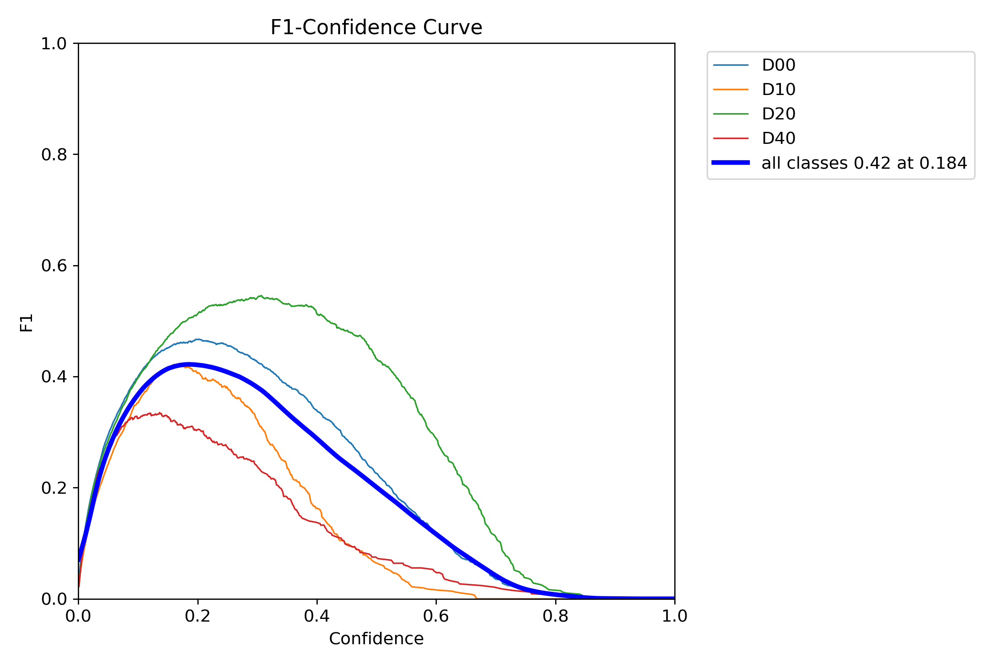

# Computer vision project
Project for computer vision. Road damage detection and labeling.

## Table of Contents
- [Dataset](#Dataset)
- [Model](#Model)
- [Training](#Training)
- [Result](#Result)

## Dataset
[RDD2022 - The multi-national Road Damage Dataset](https://figshare.com/articles/dataset/RDD2022_-_The_multi-national_Road_Damage_Dataset_released_through_CRDDC_2022/21431547/1)

## Model
[Ultralytics YOLOv8](https://github.com/ultralytics/ultralytics)
Trained on the YOLOv8 medium model

## Training

## Result

